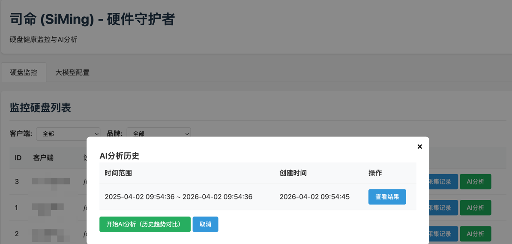
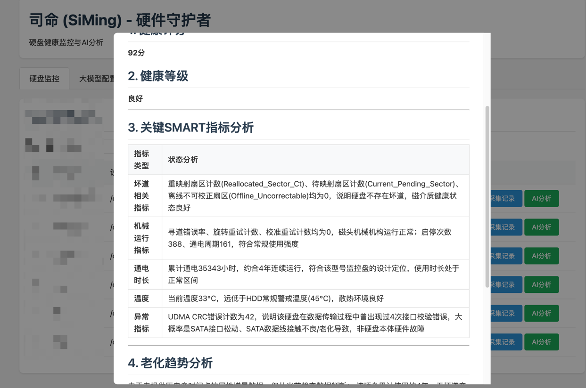
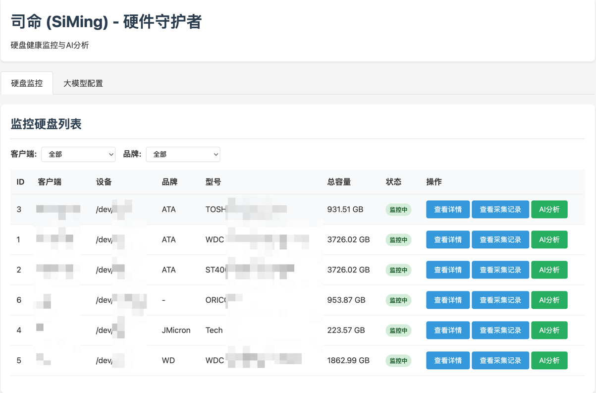

# 司命 (SiMing) - 硬件守护者

> 司命，掌管生死，守护硬件。

SiMing 是一个硬件健康监控工具，目前专注于硬盘健康监控。它可以自动发现系统中的硬盘，记录容量使用情况和 SMART 信息，并通过大模型对硬盘健康状况进行分析，给出建议和预测。

## 功能特性

- ✅ **自动发现硬盘**: 自动扫描系统中的所有硬盘，提取品牌、型号、容量等信息
- ✅ **灵活监控配置**: 手动选择需要监控的硬盘，支持自定义 cron 表达式进行定时监控
- ✅ **容量监控**: 持续记录硬盘的使用情况和剩余空间
- ✅ **SMART 监控**: 读取并保存硬盘 SMART 信息，跟踪关键属性变化
- ✅ **数据存储**: 使用 SQLite 存储所有监控数据，轻量且高效
- ✅ **大模型分析**: 接入 OpenAI API，利用大模型分析指定时间区间的硬盘健康状况，给出建议和推测
- ✅ **配置文件**: 所有配置包括大模型提示词都支持外部配置文件修改
- ✅ **Docker 支持**: 提供 docker-compose 一键部署
- ✅ **分层采集处理**: 分为采集脚本和处理服务，采集脚本采集硬盘信息，发送到处理服务，处理服务入库
- ✅ **支持四个时间维度AI比较**: 从 **now ,-7d ,-30d ,-365d** 这四个时间维度比较


## 快速开始

### 本地运行

需要 Java 17+ 和 Maven

```bash
# 克隆项目
git clone https://github.com/FightTogether/SiMing.git
cd SiMing

# 编译
mvn package -DskipTests

# 配置 (可选)
# 编辑 config/application.yml 修改配置
# 设置 OPENAI_API_KEY 环境变量

# 运行
java -jar target/siming-1.0.0.jar
```

### Docker Compose 部署

```bash
# 克隆项目
git clone https://github.com/FightTogether/SiMing.git
cd SiMing

# 配置
# 1. 创建配置目录和文件
mkdir -p config

# 2. 编辑 docker-compose.yml，添加需要监控的硬盘设备

# 3. 启动
export OPENAI_API_KEY=your_openai_api_key_here
docker-compose up -d --build

# 查看日志
docker-compose logs -f siming
```

## 使用说明

> **提示**: `apiKey` 也可以通过环境变量 `OPENAI_API_KEY` 设置，优先级更高。

## 数据表结构

- `disks`: 硬盘基本信息表
- `capacity_records`: 容量监控记录表
- `smart_records`: SMART 属性监控记录表
- `analysis_results`: 大模型分析结果表

## 大模型分析

当你积累了一段时间的监控数据后，可以使用 AI分析功能让大模型分析硬盘健康状况：

这会 从 **now ,-7d ,-30d ,-365d** 这四个时间维度比较分析：
1. 总结容量使用变化趋势
2. 分析 SMART 属性变化，重点关注异常指标
3. 评估当前硬盘健康状况，给出评分 (0-100)
4. 判断健康等级：GOOD / WARNING / CRITICAL
5. 给出相应的建议和未来趋势推测


   
## 客户端部署

SiMing 采用分离架构，服务端统一存储和分析数据，客户端部署在需要监控的服务器上采集数据。

### 一键安装客户端

在需要监控的客户端主机上执行以下命令：

```bash
# 替换为你的 SiMing 服务端地址
curl -fsSL https://your-siming-server.com/install.sh | bash -s https://your-siming-server.com
```

示例：
```bash
curl -fsSL http://192.168.1.1:8080/install.sh | bash -s http://192.168.1.1:8080
```

这个命令会：
1. 自动从服务端下载 `disk-monitor.sh` 客户端脚本
2. 自动创建 `client-config.conf` 配置文件，自动填入服务端地址
3. 自动使用当前主机名作为 `CLIENT_ID`
4. 设置执行权限，完成安装

### 客户端使用说明

安装完成后，你可以：

```bash
# 进入安装目录（默认在 ~/siming）
cd ~/siming

# 单次采集测试
./disk-monitor.sh once

# 启动守护进程（每天自动采集）
./disk-monitor.sh start

# 查看守护进程状态
./disk-monitor.sh status

# 停止守护进程
./disk-monitor.sh stop

# 重启守护进程
./disk-monitor.sh restart

# 从服务端更新到最新版本
./disk-monitor.sh update

# 查看帮助
./disk-monitor.sh help
```

## 依赖

服务端依赖：
- Java 11+
- [smartmontools](https://www.smartmontools.org/) (获取 SMART 信息，Docker 镜像已内置)
- OpenAI API Key (可选，用于大模型分析)

客户端依赖：
- bash
- curl
- smartmontools
- util-linux (lsblk)

## 项目结构

```
.
├── config/             # 配置文件目录
│   └── application.yml # 默认配置文件
├── src/
│   └── main/
│       └── java/
│           └── cn/
│               └── why360/
│                   └── siming/
│                       ├── config/         # 配置类
│                       ├── dao/            # 数据访问层
│                       ├── database/       # 数据库管理
│                       ├── entity/         # 实体类
│                       ├── scheduler/      # 定时任务调度
│                       ├── service/        # 业务服务
│                       └── SimingApplication.java # 入口
├── Dockerfile          # Docker 镜像构建
├── docker-compose.yml  # Docker Compose 配置
├── pom.xml             # Maven 配置
└── README.md
```

## 技术栈

- Java 11
- Maven
- SQLite
- Quartz (定时任务)
- HikariCP (连接池)
- OpenAI API
- Lombok

## 许可证

MIT License

## 作者

SiMing 由 [FightTogether](https://github.com/FightTogether) 维护。

## 截图


